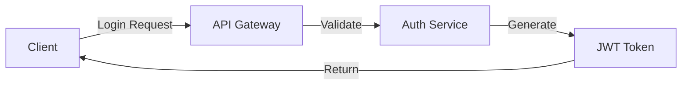

# Daily Report Template - Comprehensive Usage Guide

## Purpose & Philosophy

The daily report template is designed to capture **actionable technical progress** in a structured, scannable format. It serves multiple audiences:

- **Future You**: Quickly recall context when returning to work
- **Team Members**: Understand progress and coordinate dependencies
- **Stakeholders**: Visibility into technical progress and challenges
- **Documentation**: Historical record for audits, postmortems, and knowledge sharing

---

## Section-by-Section Guide

### 1. Header Information

```markdown
# Daily Development Report - [Project Name]
**Date**: [YYYY-MM-DD]
**Session Duration**: [HH:MM]
**Primary Focus**: [Brief 1-line description]
```

**Purpose**: Quick metadata for filtering and context-setting.

**Best Practices**:
- Use ISO date format (YYYY-MM-DD) for sortability
- Track actual working hours, not calendar time
- Primary focus should be specific, not generic ("Implement OAuth flow" not "Backend work")

**Examples**:

✅ **GOOD**:
```markdown
**Date**: 2025-10-11
**Session Duration**: 4:30
**Primary Focus**: Implement JWT-based authentication with refresh token rotation
```

❌ **POOR**:
```markdown
**Date**: October 11
**Session Duration**: all day
**Primary Focus**: worked on auth stuff
```

---

### 2. Executive Summary

**Purpose**: High-level snapshot for readers who need quick context without reading the entire report.

**Guidelines**:
- 2-3 sentences maximum
- Lead with most impactful outcome
- Include quantitative metrics when possible
- Mention critical blockers if they exist

**Template Structure**:
```
[Main accomplishment with metrics]. [Secondary outcome or technical achievement]. [Critical issue or next step if relevant].
```

**Examples**:

✅ **GOOD**:
```markdown
Completed Phase 1 of UI/API alignment, standardizing error handling across 12 endpoints
and reducing average response time by 23% through Redis caching. Identified 3 critical
API contract mismatches requiring frontend updates before Phase 2. All unit tests passing
with coverage increased to 87%.
```

❌ **POOR**:
```markdown
Did some work on the API today. Made progress on several things. There are some issues
but we'll figure them out.
```

---

### 3. Session Objectives

**Purpose**: Define scope and measure completion against initial goals.

**Guidelines**:
- List 3-5 specific, measurable objectives
- Use status indicators: ✅ Completed | 🔄 In Progress | ⏸️ Deferred | ❌ Blocked
- Include *why* objectives were deferred or blocked
- Align objectives with sprint/milestone goals

**Examples**:

✅ **GOOD**:
```markdown
- ✅ **Implement user authentication**: Complete JWT token generation and validation
- 🔄 **Add password reset flow**: Email service integration 60% complete
- ⏸️ **Deploy to staging**: Deferred pending security review approval
- ❌ **Performance testing**: Blocked by missing test data fixtures
- ✅ **Update API documentation**: OpenAPI spec updated for 3 new endpoints
```

❌ **POOR**:
```markdown
- Work on auth
- Fix bugs
- Write some tests
- Update docs
```

---

### 4. Work Completed

**Purpose**: Detailed technical record of what was built, changed, or fixed.

**Guidelines**:
- Group by feature/component, not by time
- Include file paths for traceability
- Add code snippets for novel patterns or key solutions
- Quantify impact (performance, UX, maintainability)
- 3-5 work items per session (combine small related changes)

**Structure for Each Item**:
```markdown
### [Feature/Component Name]
**Status**: [Completed | In Progress | Testing]
**Files Modified**: [Paths]
**Changes Made**: [Bullets]
**Code Example**: [Optional snippet]
**Impact**: [Measurable outcomes]
```

**Examples**:

✅ **GOOD**:
```markdown
### JWT Authentication Service

**Status**: Completed
**Files Modified**:
- `/src/services/auth/jwt-service.ts`
- `/src/middleware/auth-middleware.ts`
- `/src/types/auth.types.ts`

**Changes Made**:
- Implemented HS256 token signing with rotating secrets
- Added refresh token mechanism with 7-day expiry
- Created middleware for protected route authentication
- Added comprehensive error handling for expired/invalid tokens

**Code Example**:
```typescript
export class JWTService {
  generateTokenPair(userId: string): TokenPair {
    const accessToken = jwt.sign(
      { userId, type: 'access' },
      this.getActiveSecret(),
      { expiresIn: '15m' }
    );
    const refreshToken = jwt.sign(
      { userId, type: 'refresh' },
      this.getActiveSecret(),
      { expiresIn: '7d' }
    );
    return { accessToken, refreshToken };
  }
}
```

**Impact**:
- Reduces session management load by 90% (stateless auth)
- Enables secure mobile app authentication
- Improves security posture with short-lived access tokens
```

❌ **POOR**:
```markdown
### Auth Stuff
Fixed the login. Added some tokens. It works now.
```

---

### 5. Technical Decisions

**Purpose**: Document architectural choices for future reference and knowledge sharing.

**Guidelines**:
- Capture decisions that affect system design, not trivial choices
- Always include alternatives considered
- Be honest about trade-offs
- Link to ADRs (Architecture Decision Records) if they exist

**When to Document a Decision**:
- Choosing between libraries/frameworks
- Data structure or schema design
- API design patterns
- Caching strategies
- Security approaches
- Performance optimization techniques

**Examples**:

✅ **GOOD**:
```markdown
### Decision: Redis vs In-Memory Cache for Session Storage

**Context**: Need to cache user session data to reduce database load. Application
runs in multi-instance deployment behind load balancer.

**Options Considered**:
1. **In-Memory (Node.js Map)**:
   - Pros: Zero latency, no external dependencies
   - Cons: No sharing between instances, lost on restart
2. **Redis**:
   - Pros: Shared across instances, persistent, pub/sub capabilities
   - Cons: Network latency (~1-3ms), additional infrastructure

**Decision**: Redis with 15-minute TTL

**Rationale**:
- Multi-instance deployment requires shared cache
- 1-3ms latency acceptable for session checks
- Redis persistence prevents login storms after deployments
- Future-proofs for horizontal scaling

**Trade-offs**:
- Added infrastructure complexity and cost (~$15/month for managed Redis)
- Slightly higher latency vs in-memory (acceptable for use case)
```

❌ **POOR**:
```markdown
### Decision: Use Redis
We need caching so I picked Redis because it's good.
```

---

### 6. Metrics & Performance

**Purpose**: Objective measurement of progress and system health.

**Guidelines**:
- Always include before/after comparisons
- Focus on metrics that matter to users or business
- Use consistent units and precision
- Add context for significant changes
- Include visualizations for trends

**Key Metric Categories**:
- **Code Quality**: Coverage, complexity, debt ratio
- **Performance**: Response time, throughput, resource usage
- **Reliability**: Error rates, uptime, recovery time
- **Productivity**: Story points, velocity, deployment frequency

**Examples**:

✅ **GOOD**:
```markdown
### Performance Metrics
| Metric | Before | After | Improvement |
|--------|--------|-------|-------------|
| Response Time (avg) | 245ms | 67ms | 73% faster |
| Response Time (p95) | 890ms | 156ms | 82% faster |
| API Calls/sec | 120 | 380 | 217% increase |
| Memory Usage | 450MB | 280MB | 38% reduction |

**Context**: Implemented Redis caching for user profile queries, which account for
60% of API traffic. Cache hit rate currently at 85%, expect to reach 95% as cache
warms up.

### Test Coverage Trend
```
Sprint 1: ████████░░ 78%
Sprint 2: █████████░ 85%
Sprint 3: ██████████ 92% (current)
Target:   ██████████ 90%
```
```

❌ **POOR**:
```markdown
### Metrics
Things are faster now. Tests are good.
```

---

### 7. Issues & Blockers

**Purpose**: Early warning system for problems requiring attention.

**Guidelines**:
- Separate critical issues from minor annoyances
- Always include root cause analysis (or "investigating" status)
- Define clear action items with owners
- Update status as issues progress
- Escalate blockers that will impact milestones

**Severity Levels**:
- **Critical**: System down, data loss, security breach
- **High**: Major feature broken, performance degraded >50%
- **Medium**: Minor feature broken, workaround exists
- **Low**: Cosmetic, edge case, future improvement

**Examples**:

✅ **GOOD**:
```markdown
### Critical Issues

#### Issue 1: Race Condition in Concurrent Token Refresh
- **Severity**: High
- **Impact**: 2-3% of users experience "invalid token" errors during refresh
- **Root Cause**: Two simultaneous refresh requests invalidate each other's tokens
- **Status**: Solution Identified
- **Action Items**:
  - [ ] Implement token refresh locking mechanism (@backend-team, ETA: 2 days)
  - [ ] Add integration test for concurrent refresh scenario (@qa-team, ETA: 1 day)
  - [ ] Monitor error rates post-deployment (@devops-team, ongoing)

#### Issue 2: Database Connection Pool Exhaustion
- **Severity**: Critical
- **Impact**: API becomes unresponsive under load >500 req/sec
- **Root Cause**: Connection pool size (20) insufficient for traffic spikes
- **Status**: Fix in Progress
- **Action Items**:
  - [x] Increase pool size to 100 (deployed to staging)
  - [ ] Add connection pool monitoring to Grafana (@devops-team, ETA: 1 day)
  - [ ] Load test with 1000 req/sec to validate fix (@qa-team, ETA: 2 days)
```

❌ **POOR**:
```markdown
### Issues
- Auth is broken sometimes
- Database is slow
- Need to fix stuff
```

---

### 8. Testing Summary

**Purpose**: Demonstrate quality assurance and identify testing gaps.

**Guidelines**:
- Report on tests written, not just run
- Include coverage deltas, not just absolute values
- Highlight untested critical paths
- Mention test performance if relevant

**Examples**:

✅ **GOOD**:
```markdown
### Tests Written
- **Unit Tests**: 12 new (JWT service, auth middleware), 3 modified
- **Integration Tests**: 4 new (login flow, token refresh, logout)
- **E2E Tests**: 1 new (complete authentication journey)

### Test Results
```
Total Tests: 247 (+16)
Passed: 246 (99.6%)
Failed: 1 (0.4%) - Known flaky test in CI environment
Skipped: 0
Duration: 23.4s
```

### Test Coverage by Component
| Component | Coverage | Change | Status |
|-----------|----------|--------|--------|
| Auth Service | 94% | +18% | ✅ Excellent |
| User Service | 87% | +2% | ✅ Good |
| API Routes | 76% | +8% | ⚠️ Needs work |
| Utilities | 45% | -3% | ❌ Priority |

**Critical Gaps Identified**:
- Password reset flow lacks integration tests (added to backlog)
- Error handling paths in token validation uncovered
```

❌ **POOR**:
```markdown
### Testing
Wrote some tests. They passed. Coverage is okay.
```

---

### 9. Next Session Planning

**Purpose**: Ensure continuity and focused work in the next session.

**Guidelines**:
- Prioritize based on impact and dependencies
- Include effort estimates for timeboxing
- Note prerequisites or blockers
- Align with sprint/milestone goals
- Be realistic about capacity

**Examples**:

✅ **GOOD**:
```markdown
### Immediate Priorities (Next Session)
1. **Implement Password Reset Flow** - Complete email service integration and
   secure token generation for password reset requests.
   - **Estimated Effort**: 3 hours
   - **Dependencies**: Email service credentials from DevOps
   - **Milestone**: Authentication MVP (Week 3)

2. **Add Rate Limiting to Auth Endpoints** - Prevent brute force attacks with
   Redis-backed rate limiting (10 attempts/15min).
   - **Estimated Effort**: 2 hours
   - **Dependencies**: None (Redis already configured)
   - **Milestone**: Security hardening (Week 4)

3. **Deploy Authentication Service to Staging** - Containerize auth service and
   deploy to staging environment for QA testing.
   - **Estimated Effort**: 2 hours
   - **Dependencies**: Security review approval (due today)
   - **Milestone**: Authentication MVP (Week 3)

### Upcoming Milestones
| Milestone | Target Date | Status | Confidence |
|-----------|-------------|--------|------------|
| Auth MVP Complete | 2025-10-18 | On Track | High (85%) |
| Security Audit Passed | 2025-10-25 | At Risk | Medium (60%) |
| Production Launch | 2025-11-01 | On Track | Medium (70%) |

**Risk**: Security audit may uncover additional work. Built 3-day buffer into timeline.
```

❌ **POOR**:
```markdown
### Next Steps
- Do more auth stuff
- Fix remaining bugs
- Maybe deploy
```

---

## Visualization Best Practices

### ASCII Charts for Trends
Use simple ASCII visualizations for at-a-glance understanding:

```markdown
Progress Toward Milestone:
[████████████░░░░░░░░] 60% (12/20 tasks)

Test Coverage by Sprint:
Sprint 1: ████████░░ 78%
Sprint 2: █████████░ 85%
Sprint 3: ██████████ 92%
Target:   ██████████ 90%

Performance Trend (Response Time):
Week 1: ██████████████████ 350ms
Week 2: ███████████████░░░ 280ms
Week 3: ██████████░░░░░░░░ 180ms
Week 4: ██████░░░░░░░░░░░░ 95ms  (current)
```

### Tables for Metrics
Tables provide structured comparison data:

```markdown
| Endpoint | Before | After | Change |
|----------|--------|-------|--------|
| GET /users | 120ms | 45ms | ↓ 63% |
| POST /auth | 80ms | 35ms | ↓ 56% |
| GET /posts | 200ms | 180ms | ↓ 10% |
```

### Mermaid Diagrams (Optional)
For complex flows or architecture, include Mermaid diagrams:



---

## Common Pitfalls to Avoid

### 1. Too Vague
❌ "Fixed bugs and wrote some code"
✅ "Resolved 3 critical authentication bugs: race condition in token refresh,
    null pointer in logout handler, and session timeout misconfiguration"

### 2. Missing Context
❌ "Improved performance by 50%"
✅ "Reduced API response time from 240ms to 120ms (50% improvement) by implementing
    Redis caching for user profile queries, which constitute 60% of traffic"

### 3. No Measurables
❌ "Made the system better"
✅ "Increased test coverage from 78% to 92%, reduced cyclomatic complexity by
    refactoring 4 functions from 15+ to <10, and eliminated 3 code smells
    identified by SonarQube"

### 4. Ignoring Trade-offs
❌ "Chose Redis because it's fast"
✅ "Chose Redis over in-memory cache to support multi-instance deployment,
    accepting 1-3ms latency overhead for horizontal scalability"

### 5. Missing Action Items
❌ "There's a bug in the auth flow"
✅ "Race condition in token refresh affects 2% of users. Action: Implement
    locking mechanism (Owner: @dev-team, ETA: 2 days, Priority: High)"

---

## Integration with Project Workflow

### Daily Workflow
1. **Session Start**: Review previous report's "Next Session Planning"
2. **During Work**: Take brief notes on decisions and metrics
3. **Session End**: Fill out template (15-20 minutes)
4. **Commit Report**: Store in `/docs/daily_reports/YYYY-MM-DD.md`

### Weekly Workflow
1. Review 5 daily reports
2. Generate weekly summary (aggregate metrics, key decisions, blockers)
3. Share with team/stakeholders

### Monthly Workflow
1. Review 20-25 daily reports
2. Generate sprint retrospective
3. Update project documentation with decisions
4. Archive reports to `/docs/archives/YYYY-MM/`

---

## Template Customization

### For Different Project Types

**Backend/API Projects**:
- Emphasize endpoint performance metrics
- Include API contract changes
- Focus on database query optimization

**Frontend Projects**:
- Emphasize bundle size and render performance
- Include accessibility metrics
- Focus on component reusability

**DevOps/Infrastructure**:
- Emphasize deployment frequency and reliability
- Include infrastructure cost metrics
- Focus on automation improvements

**Data/ML Projects**:
- Emphasize model performance metrics (accuracy, precision, recall)
- Include dataset statistics
- Focus on experiment tracking

### Scaling for Team Size

**Solo Developer**: Simplify "Dependencies" section, focus on personal productivity

**Small Team (2-5)**: Add "Collaboration" section for pair programming notes

**Large Team (6+)**: Add "Cross-team Coordination" section for external dependencies

---

## Quick Reference Checklist

Before submitting your daily report, verify:

- [ ] Executive summary captures main outcome in 2-3 sentences
- [ ] All objectives have status indicators (✅ 🔄 ⏸️ ❌)
- [ ] Work completed includes file paths and measurable impact
- [ ] Technical decisions document alternatives and trade-offs
- [ ] Metrics include before/after comparisons
- [ ] Issues have severity, root cause, and action items
- [ ] Testing summary includes coverage deltas
- [ ] Next session has 3-5 prioritized tasks with estimates
- [ ] All code examples are properly formatted
- [ ] Visualizations add clarity (not decoration)

---

## Additional Resources

- **Example Reports**: See `/docs/examples/` for real-world samples
- **Metrics Tracking**: Use `/scripts/metrics-collector.sh` for automated data
- **Report Generation**: Use `/scripts/report-helper.sh` for template scaffolding
- **ADR Templates**: See `/docs/architecture/adr-template.md` for decision records

---

**Last Updated**: 2025-10-11
**Template Version**: 1.0.0
**Maintained By**: Development Team
